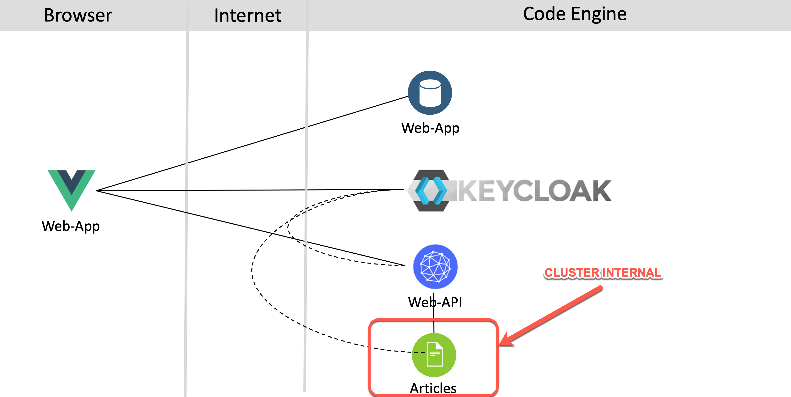

## Brief architecture overview

In the workshop we use a customized version of the [security application example](https://developer.ibm.com/languages/java/tutorials/secure-your-java-microservices-application-workshop/). The example application simply shows articles protected with an `Identity and Access Manegement`. In the following picture you see the frontend with the articles and the valid user `alice` is logged on.

The following diagram shows the architecture of the example application. There is a `web-app` frontend application that serves the JavaScript/Vue.js code to the browser. The `web-app` code running in the browser invokes a REST API of the `web-api` microservice. The `web-api` microservice in turn invokes a REST API of the `articles` microservice. [`Keycloak`](https://www.keycloak.org/) is used for the `Identity and Access Management` of that microservices based application. To see the results in the web application, users need to be authenticated and they need to have the role `user`.

The image below shows the dependencies of the example:

# ce-cns
# ce-cns
